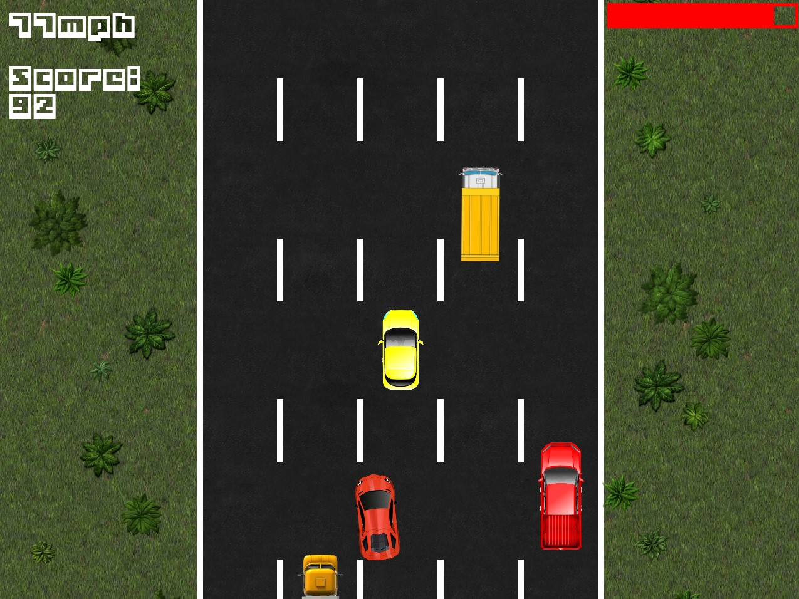
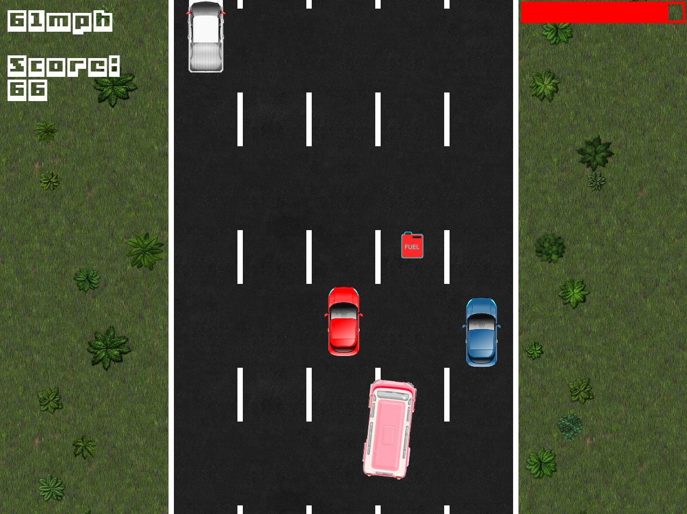

# Racer

This is a simple 2d racing game.
Your goal is to score as many points as possible.
You must avoid collisions and collect fuel.
When you bump into another vehicle or run out of fuel - the game is over.
More speed = more points.

## Gameplay screenshots

## How to start the game

Clone or download this repo and run `bin/racer.exe` to start the game.

## Technologies and sources

The game was written in C++ using the [SFML](https://www.sfml-dev.org) library (version 2.5.1). 
Most of the textures are from [opengameart.org](https://opengameart.org) and [itch.io](https://itch.io).
For collisions we used [this](https://github.com/SFML/SFML/wiki/Source%3A-Simple-Collision-Detection-for-SFML-2) collision detector.
